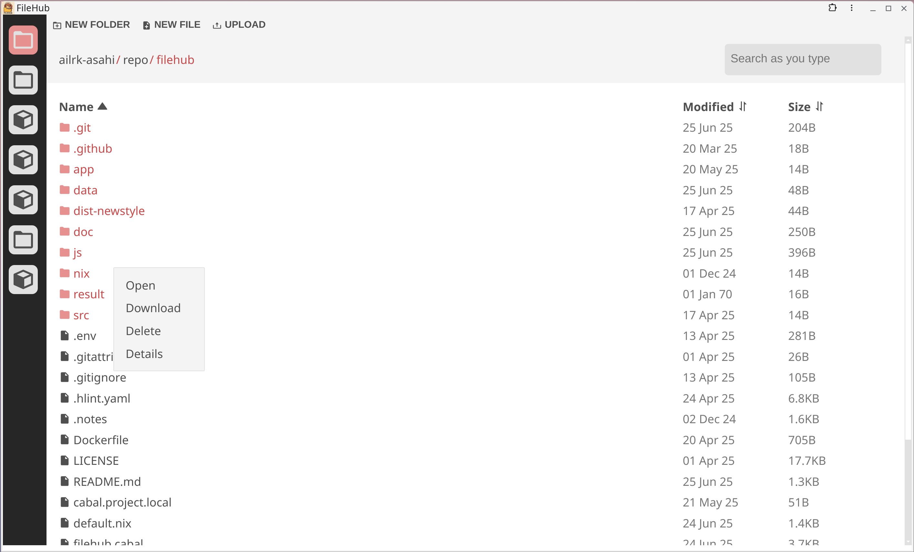

# Filehub


Filehub is a simple, no frills, web based, self-hostable file browser.


<div style="display: flex; gap: 10px;">
  
  
  
  
</div>


### Download
You can download binary from the release.


### Setup
To start an instance, run the following command:

```
filehub --port 8080 --root $HOME --theme dark1
```

Now you can access `$HOME` directory on `http://localhost:8080`.


### Nix
There is a nix module defined in `/nix` folder.
