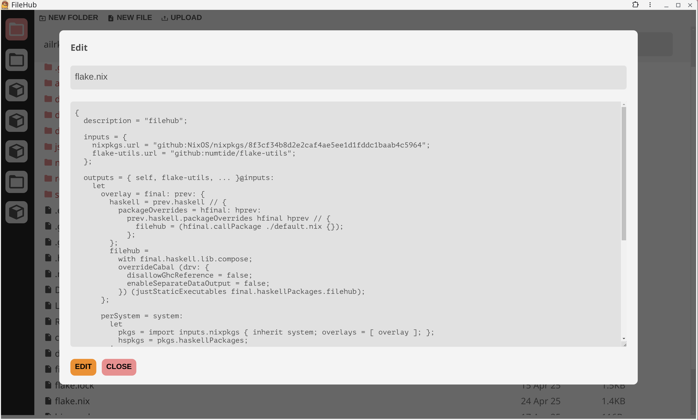
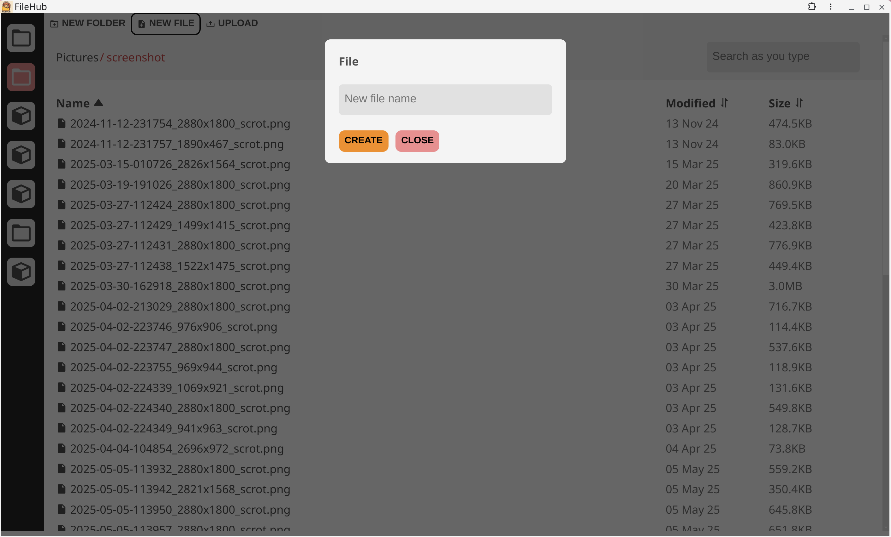

# Filehub

Filehub is a simple, no-frills, web-based, self-hosted file browser. It provides a unified interface for managing files across multiple backends simultaneously—for example, allowing you to browse and operate on files from both S3 and the local filesystem as if they were in the same place.


<div style="display: flex; gap: 10px;">
  
  
</div>

<div style="display: flex; gap: 10px;">
  
  
</div>


<div style="display: flex; gap: 10px;">
  
  
  
</div>


### Download
You can download binary from the release.


### Setup
To start an instance, run the following command:

```
filehub --port 8080 --theme dark --fs $HOME
```


Now you can access the local `$HOME` directory on `http://localhost:8080`.


To add a S3 target, you can use the `--s3 <bucket>` option

```
filehub --port 8080 --theme dark --s3 book --s3 files
```

Filehub will search for the AWS credentials from the standard locations. Note: if you use a third party S3 provider, you can provide the endpoint via `AWS_ENDPOINT_URL`.


### Features
- File manager style interface
- Multiple storage backend (curently supports posix file system and S3)
- Copy/paste files across storage backends.
- Image viewer.
- PDF, Video, audio supports.
- Sorting
- Read only mode


### Nix
There is a nix module defined in `/nix` folder.
